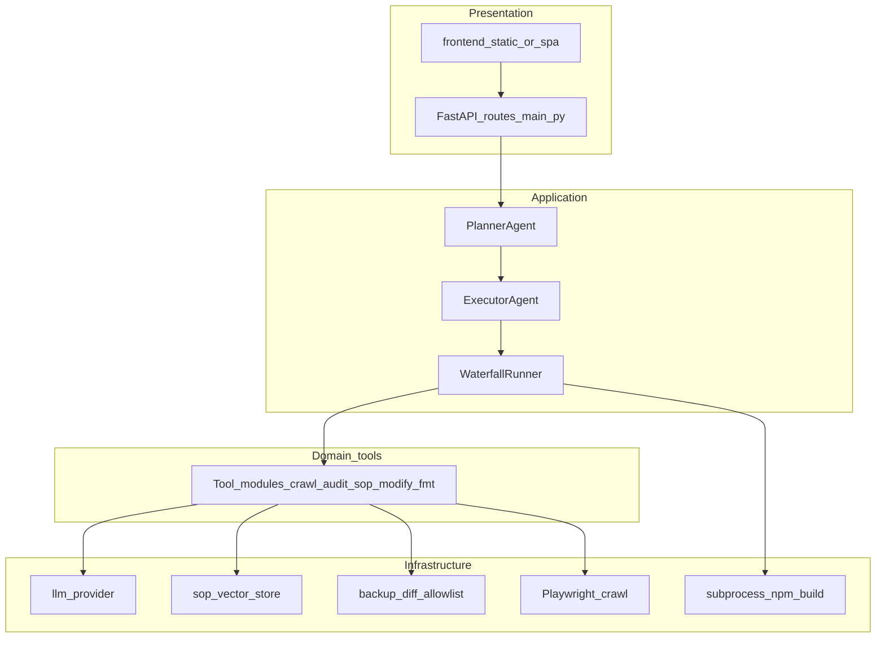
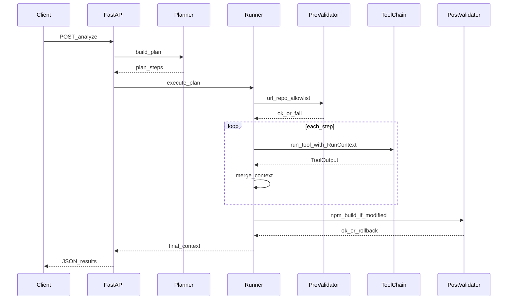
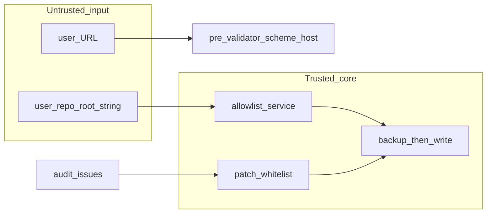

# Day-6 SEO Agent — system architecture

## Scope

This document describes the **runtime structure** of the MVP under `day-6/seo-agent/`. It refines the flowchart in [plan.md](../../plan.md) with **layers, contracts, and trust boundaries**. Authoritative task IDs and done criteria remain in [tasks.md](../../tasks.md); the product spec is [seo_agent_requirements.txt](../../seo_agent_requirements.txt).

---

## Layered logical architecture

**Rule:** Dependencies point **inward** (outer layers depend on inner abstractions, not the reverse).

| Layer | Responsibility | Key modules |
|--------|----------------|-------------|
| **Presentation** | HTTP + UI; request/response DTOs only | `main.py`, `frontend/` |
| **Application** | Plan building, step sequencing, status timeline | `app/agents/planner.py`, `app/agents/executor.py`, `app/orchestrator/runner.py` |
| **Domain (tools)** | Pure(ish) steps: crawl, audit, SOP validation, format; side effects isolated behind services | `app/tools/*.py` |
| **Infrastructure** | IO: LLM HTTP/embeddings, local SOP vector index, filesystem, browser, shell | `app/services/llm_provider.py`, `app/services/allowlist.py`, backup helpers, `app/rag/chroma_store.py`, Playwright in `crawl`, `app/validators/` post-build |

**Import rule:** `app/tools/*` may call `app/services/*` and `app/rag/*`; they must **not** import FastAPI or HTTP route handlers. `main.py` wires routes to the application layer only.

---

## Runtime sequence (single request)

Aligns with [tasks.md](../../tasks.md): `User Input → Planner → Orchestrator → Tools → Validators → Output`.

---

## Core contract: `RunContext`

Single mutable (or copy-on-write) bag the **WaterfallRunner** owns; each tool receives **context + step input** and returns a **typed output** merged back.

**Suggested fields (conceptual):**

- **Request:** `url`, `depth`, `max_pages`, `dry_run`, `apply_fixes`, `repo_root` (optional string), `run_id` (UUID per request).
- **Resolved:** `repo_path: Path | None` (after allowlist), `plan: list[PlanStep]`, `step_status: dict[str, StepState]`.
- **Artifacts:** `pages: list[PageRecord]`, `stack: StackInfo | None`, `issues: list[Issue]`, `sop_enrichments: list[SopRow]`, `modify_result: ModifyResult | None` (diffs, backups, files_touched), `formatted: FormattedResponse | None`.
- **Errors:** `fatal_error: ErrorEnvelope | None` (first hard failure stops runner unless step optional).

Tools **do not** read raw JSON from prior tools; the runner passes **Pydantic models** only.

---

## Tool registry pattern

`app/orchestrator/registry.py`: map `tool_id` → `Callable[[RunContext], Awaitable[ToolResult]]` (or sync if you avoid async initially). **WaterfallRunner** reads `PlanStep.id`, looks up handler, validates output schema, then merges into `RunContext`.

**Tool IDs (fixed):** `crawl`, `detect_stack`, `seo_audit`, `sop_validate`, `code_modify`, `format_results` ([tasks.md](../../tasks.md) Phase 2).

---

## Security and trust boundaries

- **Network:** Only `crawl` and link-check logic follow user `url` and discovered same-origin links; pre-validator enforces `http`/`https` and optional host allowlist.
- **Filesystem:** `code_modify` may touch paths only under **`repo_path`** resolved and prefix-checked against **`SEO_AGENT_REPO_ALLOWLIST`** ([tasks.md](../../tasks.md) Task 0.5). Backups under `.seo-agent-backups/<run_id>/`.
- **Post-build:** `subprocess` runs with `cwd=repo_path`; non-zero exit triggers **full restore** from backups for that run.

---

## RAG and LLM architecture

- **`app/services/llm_provider.py`:** single facade: `embed(texts) -> vectors`, `chat(messages, schema) -> structured dict` (or JSON mode). Implemented via Ollama HTTP, local sentence-transformers, etc. ([tasks.md](../../tasks.md) Task 0.6).
- **`app/rag/chroma_store.py`:** local persisted **JSON + numpy** index (class name `ChromaSopStore` for compatibility); cosine similarity; ingest at startup; query used by **`sop_validate`** only (audit issues stay deterministic in `seo_audit`).

**Dependency direction:** `sop_validate` → `llm_provider` + `chroma_store`; RAG seeding on startup may call `llm_provider.embed` — avoid circular imports by keeping ingest in `app/rag/ingest.py` or lazy init.

---

## Frontend and API boundary

- **`POST /analyze`:** one DTO in, one DTO out ([tasks.md](../../tasks.md) Phase 6). `format_results` produces the **canonical** `results` object; route handler does not reshape beyond HTTP status mapping.
- **Frontend** consumes only that schema (issues table, SOP expansion, `diffs[]`, `post_build`).

---

## Testing architecture

- **Unit:** tools + `allowlist` + `llm_provider` mocks + HTML fixtures ([tasks.md](../../tasks.md) Phase 8).
- **Integration:** FastAPI `TestClient` + temp copy of `sample-site` or subprocess dev server; assert plan + `post_build.ok` on happy path and rollback on failure.

---

## Relationship to other diagrams

The pipeline flowchart in [plan.md](../../plan.md) shows tool order and validators at a glance; this document adds **layering, sequence, RunContext, registry, and trust boundaries** for implementers.
